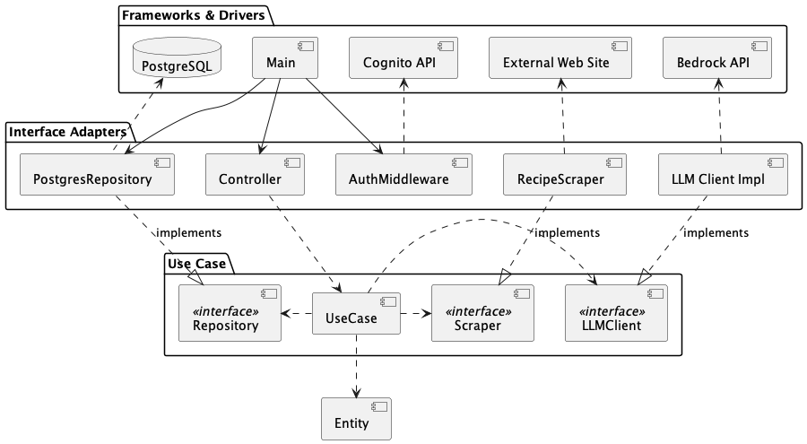
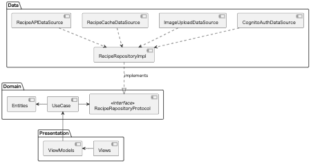

## APIエンドポイント

- **GET**  `/recipes`                 : レシピを一括取得
- **POST** `/recipes`                 : レシピ新規作成
- **PUT**  `/recipes`                 : レシピを更新
- **GET**  `/recipes/search`          : レシピを検索
- **GET**  `/recipes/:id`             : レシピを取得
- **DELETE** `/recipes/:id`           : レシピを削除
- **POST** `/recipes/fetch`           : 外部情報(URL)からレシピを新規作成
- **POST** `/recipes/fetch/instagram` : Instagramからレシピ取得
- **DELETE** `/account`               : アカウントに基づくデータの削除

## コンポーネント図

### server

### client
